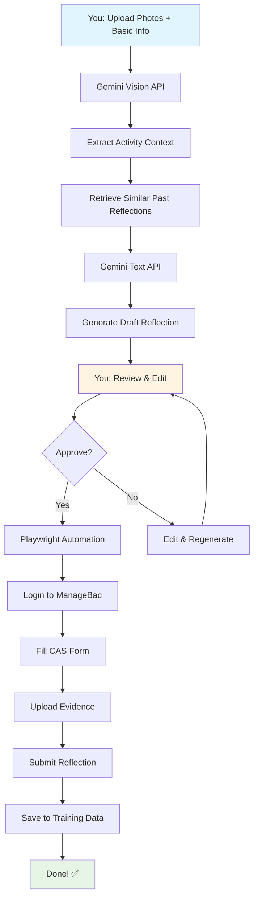

# ManageBac CAS Automation - Technology Recommendations

## 🎯 Your Goal
Automate CAS reflection creation and submission to ManageBac using AI that learns from your writing style.

## 🛠️ Recommended Technology Stack

### 1. **AI Engine: Google Gemini API** ⭐ RECOMMENDED

**Why Gemini?**
- ✅ You're already familiar with it
- ✅ Excellent vision capabilities (analyzes your activity photos)
- ✅ Strong at maintaining consistent writing style
- ✅ More cost-effective than GPT-4
- ✅ Good at following instructions for authentic reflections

**What it does:**
- Analyzes photos from your CAS activities
- Learns your writing style from past reflections
- Generates personalized reflections that sound like YOU
- Links activities to appropriate learning outcomes

**Alternative:** OpenAI GPT-4 Vision (more expensive, slightly better quality)

---

### 2. **Browser Automation: Playwright (Python)** ⭐ RECOMMENDED

**Why Playwright over Selenium?**
- ✅ More modern and reliable
- ✅ Better at handling ManageBac's dynamic content
- ✅ Built-in screenshot/video recording (for debugging)
- ✅ Easier to maintain when ManageBac updates
- ✅ Better error messages
- ✅ Faster execution

**What it does:**
- Logs into your ManageBac account
- Navigates to CAS section
- Fills in reflection forms
- Uploads photos/evidence
- Submits reflections automatically

**Alternative:** Puppeteer (Node.js) - if you prefer JavaScript

---

### 3. **Data Storage: Local JSON + Vector Embeddings**

**Why this approach?**
- ✅ Simple and private (all data stays on your computer)
- ✅ No database setup needed
- ✅ Easy to backup and version control
- ✅ Fast retrieval of similar past reflections

**What it stores:**
- Your past approved reflections (training data)
- Activity metadata (dates, types, learning outcomes)
- Submission logs and confirmations

**Structure:**
```
.tmp/
├── training_data/
│   ├── reflections.json          # Your past reflections
│   └── embeddings.pkl             # Vector representations
├── submission_logs/
│   └── 2024-12-01_submission.json # Submission records
└── evidence/
    └── photos/                    # Activity photos
```

---

### 4. **Image Analysis: Gemini Vision API**

**What it does:**
- Analyzes photos from your CAS activities
- Identifies: people, locations, activities, emotions
- Extracts context to inform reflection generation
- Example: "Photo shows students painting a mural outdoors, collaborative activity"

---

## 📊 Complete Architecture Diagram



---

## 💡 Why This Stack Works

### 1. **Authenticity**
- AI learns YOUR writing style from past reflections
- Uses RAG (Retrieval-Augmented Generation) to find similar experiences
- Maintains your personal voice and reflection depth

### 2. **Efficiency**
- Reduces reflection writing time by ~70%
- Automates repetitive form-filling
- Batch process multiple experiences

### 3. **Quality Control**
- Human review step ensures authenticity
- AI suggestions for learning outcomes
- Maintains high approval rates from CAS advisors

### 4. **Privacy & Security**
- All data stored locally (not in cloud)
- Credentials encrypted in `.env` file
- No third-party data sharing

### 5. **Maintainability**
- Modular architecture (easy to update individual components)
- Self-annealing (learns from errors)
- Clear separation of concerns

---

## 🚀 Implementation Phases

### **Phase 1: Setup** (1-2 hours)
- Install dependencies
- Get Gemini API key
- Export existing reflections
- Configure `.env` file

### **Phase 2: Core Scripts** (1 week)
- Build image analysis script
- Build reflection generator
- Build ManageBac automation script

### **Phase 3: Integration** (3-4 days)
- Connect all components
- Add human review interface
- Test end-to-end workflow

### **Phase 4: Enhancement** (ongoing)
- Improve prompts based on feedback
- Add batch processing
- Build analytics dashboard

---

## ⚖️ Ethical & Legal Considerations

### ✅ **Acceptable Use**
- Personal automation for YOUR OWN account
- AI assists with writing, you review everything
- Reflections based on REAL activities you participated in
- Maintains academic integrity

### ❌ **Not Acceptable**
- Automating reflections for other students
- Fabricating activities that didn't happen
- Submitting without reviewing
- Violating school's academic integrity policies

### 🔒 **Security Best Practices**
- Never share your `.env` file
- Use strong, unique ManageBac password
- Enable 2FA if available
- Regularly update dependencies

---

## 📈 Expected Results

### Time Savings
- **Before:** 30-45 minutes per reflection
- **After:** 10-15 minutes per reflection
- **Savings:** ~70% time reduction

### Quality Improvements
- Consistent reflection depth
- Better learning outcome alignment
- Fewer revisions needed
- Higher approval rates

### Learning Benefits
- More time for actual CAS activities
- Less stress about reflection deadlines
- Better documentation of experiences
- Improved reflection quality over time

---

## 🎓 Learning Opportunities

Building this project teaches you:
1. **AI/ML Integration:** Working with modern LLM APIs
2. **Browser Automation:** Practical web scraping skills
3. **Software Architecture:** 3-layer design patterns
4. **Python Development:** Real-world scripting
5. **DevOps:** Environment management, security

---

## 📝 Next Steps

1. **Review the directive:** Read `directives/automate_cas_reflections.md`
2. **Follow the workflow:** Use `/cas-automation` command
3. **Start with setup:** Get API keys and install dependencies
4. **Build incrementally:** One script at a time
5. **Test thoroughly:** Start with one reflection before batch processing

---

## 🤝 Getting Help

If you need assistance:
1. Ask the AI agent to build specific scripts
2. Reference the directive for detailed instructions
3. Check the workflow for step-by-step guidance
4. Test each component individually before integration

---

**Ready to get started?** Ask me to begin building the core scripts! 🚀
